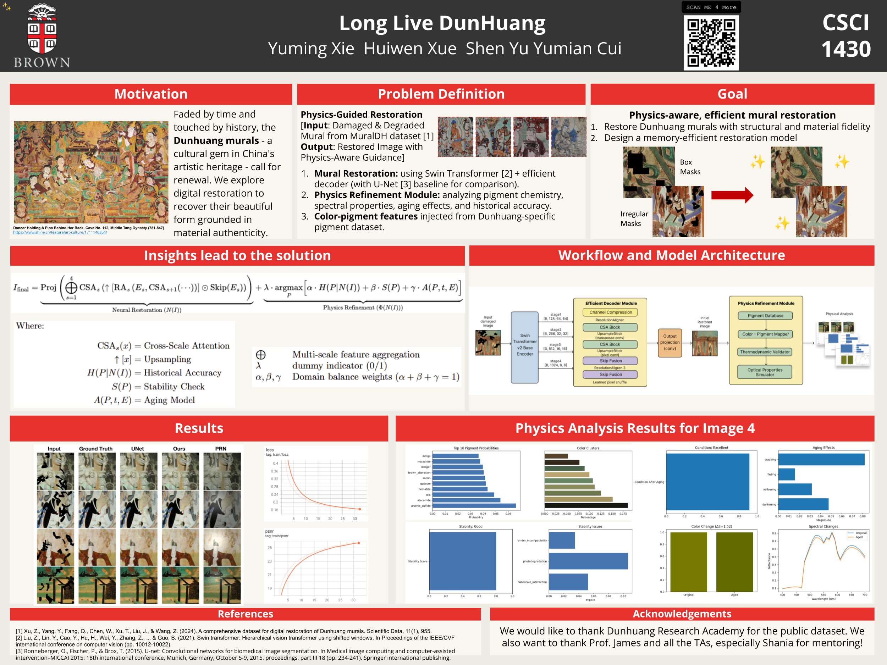
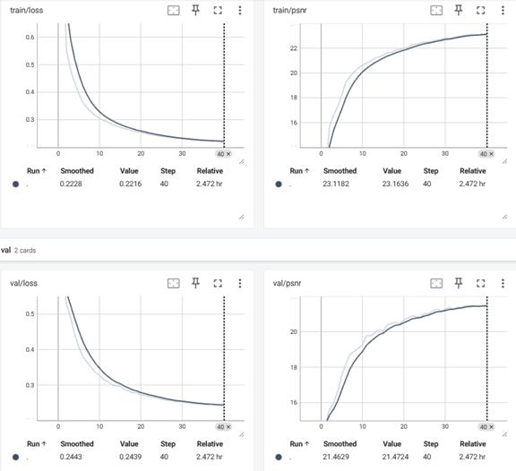
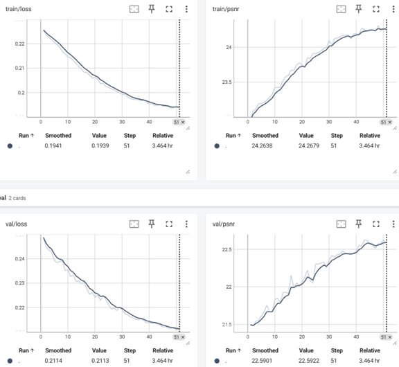

Here is the wrokflow of DunHuang Mural Restoration process:


# MuralLoss: Combined Loss for Mural Restoration

This project implements a custom loss function **MuralLoss**, designed for mural restoration tasks.  
It combines multiple complementary components to balance pixel-level accuracy, structural fidelity, perceptual similarity, and fine details.

## 📌 Loss Components

### 1. L1 Loss
- Ensures pixel-wise accuracy (color and brightness consistency).  
- Widely used as a baseline in image restoration.  

### 2. SSIM Loss
- Measures **structural similarity** between restored and ground-truth images.  
- More consistent with human visual perception compared to L1/MSE.  
- Formula:  
  =\frac{(2\mu_x\mu_y+C_1)(2\sigma_{xy}+C_2)}{(\mu_x^2+\mu_y^2+C_1)(\sigma_x^2+\sigma_y^2+C_2)})  

  (Plain text version for GitHub preview:)  
  `SSIM(x,y) = ((2 * μx * μy + C1) * (2 * σxy + C2)) / ((μx^2 + μy^2 + C1) * (σx^2 + σy^2 + C2))`


- Reference:  
  > Wang, Z., Bovik, A. C., Sheikh, H. R., & Simoncelli, E. P. (2004).  
  > *Image quality assessment: From error visibility to structural similarity*.  
  > IEEE Transactions on Image Processing, 13(4), 600–612.

### 3. Perceptual Loss
- Uses deep feature maps (e.g., VGG) to measure semantic and perceptual similarity.  
- Encourages the restored mural to preserve high-level content and style.  
- Reference:  
  > Johnson, J., Alahi, A., & Fei-Fei, L. (2016).  
  > *Perceptual losses for real-time style transfer and super-resolution*.  
  > ECCV.

### 4. Edge-aware Loss
- Extracts edges via Sobel filters and minimizes their difference.  
- Ensures sharper edges, textures, and cracks — critical for mural restoration.  
- Reference:  
  > Zhang, K., Zuo, W., & Zhang, L. (2019).  
  > *Deep Plug-and-Play Super-Resolution for Arbitrary Blur Kernels*.  
  > CVPR.

---

## ⚖️ Total Loss

The final loss is a weighted combination:


(Plain text version:)  
`L_total = λ1 * L1 + λ2 * L_SSIM + λ3 * L_Perceptual + λ4 * L_Edge`


Default weights:
- `l1_weight = 1.0`  
- `ssim_weight = 0.5`  
- `perceptual_weight = 0.1`  
- `edge_weight = 0.2`

---

## 🖼️ Why MuralLoss?

- **L1**: keeps global colors accurate  
- **SSIM**: preserves structure  
- **Perceptual**: maintains semantic meaning  
- **Edge-aware**: enhances fine details  
This makes it especially suitable for **mural restoration**, where both **visual fidelity** and **structural consistency** are crucial.

## Phase 1: Freeze Encoder, Train Decoder Only

### Training Setup
- **Goal**: Fine-tune the decoder on the Mural dataset while keeping the encoder frozen (feature extractor remains fixed).
- **Configuration**:
  - Optimizer: **Adam** with cosine annealing learning rate scheduler
  - Loss: Weighted combination of **L1 + SSIM + Perceptual Loss**
  - Batch size: **8**
  - Image size: **256 × 256**
  - Initial learning rate: **1e-4**
  - Epochs: **50** (with early stopping, patience = 5)

### Training Process
- The encoder parameters were frozen during this stage.
- Only the decoder parameters were updated.
- Both training and validation metrics (Loss, PSNR) were monitored with TensorBoard.

### Results
- Training stopped at **epoch 40** due to early stopping.
- **Best model performance**:
  - Train Loss ≈ **0.22**
  - Validation Loss ≈ **0.24**
  - Train PSNR ≈ **23.1 dB**
  - Validation PSNR ≈ **21.5 dB**

### Visualization
Training and validation curves:



### Conclusion
- The model shows clear convergence: training and validation losses decrease steadily, while PSNR increases.
- Validation PSNR reached **21.5 dB**, showing noticeable improvement over the initial state.
- This phase successfully adapted the decoder. The next step will be **Phase 2: Unfreeze encoder and fine-tune the whole model**.

## Phase 2A: Fine-tuning with Unfrozen Encoder Stage4

In this step, we partially fine-tuned the model by **unfreezing the last stage (stage4) of the encoder** while keeping the earlier encoder layers frozen.  
This allows the model to adapt deeper encoder features to the mural dataset, while avoiding the instability of full fine-tuning.

### Training Setup
- **Dataset:** Mural dataset  
- **Image size:** 512 × 512  
- **Batch size:** 8  
- **Epochs:** 60 (early stopped at epoch 51)  
- **Optimizer:** Adam (lr = 1e-3 with CosineAnnealingLR scheduler)  
- **Loss Function:** Combination of L1, SSIM, Perceptual, and Edge losses  
- **Hardware:** CUDA backend  

### Results
- **Best PSNR (train):** 24.27 dB  
- **Best PSNR (val):** 22.63 dB  
- **Final Epoch:** 51 (early stopping triggered after 8 epochs without PSNR improvement)  

### Training Curves
Below are the training and validation curves for **loss** and **PSNR** during Phase 2A:



From the curves:
- Both training and validation loss decreased steadily.  
- PSNR improved compared to Phase 1, but still leaves room for further improvement when fine-tuning the **entire encoder** (Phase 2B).

---

## Comparison with Phase 1
| Phase   | Encoder Status       | Best Train PSNR | Best Val PSNR |
|---------|---------------------|-----------------|---------------|
| Phase 1 | Encoder frozen       | ~23.18 dB       | ~21.46 dB     |
| Phase 2A| Stage4 unfrozen only | **24.27 dB**    | **22.63 dB**  |

➡ Next step: **Phase 2B** (fine-tune the full encoder + decoder) to further improve performance.

## Phase 2B — Full Model Fine-tuning (All Encoder Stages Unfrozen)

This experiment fine-tunes the **entire network** (encoder stages 1–4 + decoder), starting from the Phase 2A best checkpoint.

### Training Configuration
- **Command**
  ```bash
  python -m models.efficient_models.train \
      --data_path ./Mural \
      --image_size 256 \
      --batch_size 8 \
      --epochs 50 \
      --lr 3e-5 --min_lr 1e-6 \
      --num_workers 0 \
      --l1_weight 1.0 --ssim_weight 0.5 --perceptual_weight 0.1 --edge_weight 0.2 \
      --unfreeze_encoder_stages stage1 stage2 stage3 stage4 \
      --best_weights ./output_phase2/stage4/checkpoints/best_model.pth \
      --output_dir ./output_phase2/full \
      --patience 10 \
      --grad_clip 1.0

  
Optimizer / Scheduler: Adam + CosineAnnealingLR

Loss: L1 + SSIM + Perceptual + Edge

Results (50 epochs, no early stopping)

Best Validation PSNR: 23.80 dB (achieved before epoch 50)

Validation PSNR at epoch 50: 23.79 dB

Validation Loss at epoch 50: ~0.1692

Training PSNR at epoch 50: ~25.74 dB

Training Loss at epoch 50: ~0.1544

Note: We report the best validation PSNR (23.80 dB) for model selection, which may occur before the final epoch.

Curves


Observations

Both train and validation losses steadily decreased over the 50 epochs.

Validation PSNR improved from ~22.6 dB in Phase 2A to 23.8 dB in Phase 2B, confirming the benefit of full-model fine-tuning.

The gap between train (≈25.7 dB) and validation (≈23.8 dB) PSNR is expected and indicates normal generalization behavior.

Summary of Results
Phase	Encoder Training	Best Val PSNR (dB)	Final Epochs	Notes
Phase 1	Frozen (Decoder only)	21.48	40 (early stopped)	Decoder adaptation
Phase 2A	Unfreeze Stage 4	22.63	51 (early stopped)	Partial fine-tuning
Phase 2B	Unfreeze All (1–4)	23.80	50	Full model fine-tuning


